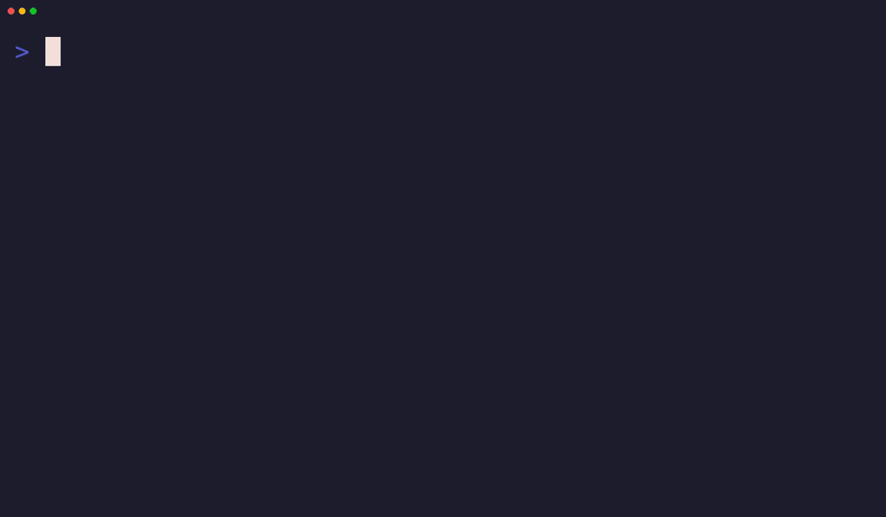

# daylog

[](https://github.com/tfolkman/daylog/actions/workflows/ci.yml)
[](https://crates.io/crates/daylog)
[](LICENSE)

A terminal dashboard that tracks your life from markdown notes.



## Install

```bash
cargo install daylog
```

Or download a pre-built binary from [GitHub Releases](https://github.com/tfolkman/daylog/releases).

## Quick Start

```bash
daylog init
daylog
```

Two commands to a working dashboard. No API keys, no Docker, no config files to write.

## What It Does

daylog reads your daily markdown notes (one per day, `YYYY-MM-DD.md`) and renders a live terminal dashboard. Edit a note, save it, see the TUI update in real time.

```yaml
---
date: 2026-03-28
sleep: "10:30pm-6:15am"
weight: 173.4
mood: 4
energy: 3
type: lifting
lifts:
  squat: 185x5, 205x3, 225x1
  pullup: BWx8, BWx6
resting_hr: 52
---

## Notes

Hit a squat PR today.
```

## Three Tiers of Extensibility

### Tier 1: Track any number (config only)

```toml
[metrics]
resting_hr = { display = "Resting HR", color = "red", unit = "bpm" }
```

Add a YAML field, get a sparkline. Zero code.

### Tier 2: Track any exercise (config only)

```toml
[exercises]
turkish_getup = { display = "Turkish Getup", color = "cyan" }
```

Training tab shows it. Trends tab shows 1RM progression. Zero code.

### Tier 3: Build a module (code required)

For domains needing custom tables and visualization. The climbing module is the reference implementation — one directory, one trait, one line in the registry.

## CLI

```bash
daylog                          # Launch the TUI
daylog log weight 173.4         # Log a value (no quotes needed)
daylog log lift squat 185x5     # Log a lift
daylog log sleep 10:30pm-6:15am # Log sleep
daylog log metric resting_hr 52 # Log a custom metric
daylog sleep-start              # Record bedtime (uses now, or pass a time)
daylog sleep-end                # Finalize sleep entry on today's note
daylog status --json            # Today's data as JSON
daylog edit                     # Open today's note in $EDITOR
daylog sync                     # Sync DB without launching TUI
daylog rebuild                  # Rebuild DB from all notes
```

### Sleep across midnight

`daylog sleep-start` and `daylog sleep-end` automate the past-midnight
date math (sleep is recorded on the file for the day you wake up):

```bash
daylog sleep-start              # before bed (or: daylog sleep-start 22:30)
daylog sleep-end                # after waking (or: daylog sleep-end 06:15)
# → writes `sleep: "10:30pm-6:15am"` to today's note
```

The pending bedtime lives in a `.daylog-state.toml` sidecar next to the
database (in `notes_dir`). If you sync `notes_dir` across machines via
git/Dropbox/iCloud, add `.daylog-state.toml` to your ignore list — the
sidecar is per-machine state and is not designed for cross-device sync.

### Logging food, notes, and BP from the CLI

Three top-level subcommands append timestamped entries to the
`## Food`, `## Notes`, and `## Vitals` sections of the day's note,
auto-inserting the section if it's missing.

```bash
# Food — nutrition-db lookup with gram or ml amount
daylog food "kelda skogssvampsoppa" 500g
daylog food "helmjölk" 250ml

# Food — total-panel foods need no amount
daylog food te
daylog food proteinshake

# Food — one-off custom item, all four macros required together;
# --gi / --gl / --ii independently optional. GL auto-computes when
# GI and carbs are both known.
daylog food --kcal 350 --protein 7 --carbs 24 --fat 25 \
            --gi 50 "Random pasta dish" 500g

# Note — literal text or a [notes.aliases] key
daylog note "Attentin 10mg"
daylog note med-morning

# BP — sys dia pulse; auto-picks bp_morning_* or bp_evening_*
# based on the measurement time vs. the 14:00 cutoff. --morning /
# --evening override.
daylog bp 141 96 70
daylog bp --evening 133 73 62

# Shared flags: --date YYYY-MM-DD and --time HH:MM (or H:MMam/pm)
# for retroactive entries.
daylog note --date 2026-04-29 --time 23:30 "Aritonin"
daylog bp --time 08:00 141 96 70   # logged at 14:30 — still morning
```

`[notes.aliases]` in `config.toml` lets you map short keys to
longer note text:

```toml
[notes.aliases]
med-morning = "Morgonmedicin (Elvanse 70mg, Escitalopram 20mg, Losartan/Hydro 100/12.5mg, Vialerg 10mg)"
```

These commands write the markdown only; the watcher re-materializes
the database within ~500 ms.

## Tabs

- **Dashboard**: Today's vitals — sleep, weight, mood, energy, session context
- **Training**: Lifts, TSB gauge, session metrics
- **Trends**: 42-day sparklines for weight, exercises, and custom metrics
- **Climbing** (opt-in): Grade pyramid, weekly progression, session summary

## Config

`~/.config/daylog/config.toml`:

```toml
notes_dir = "~/daylog-notes"
# refresh_secs = 15
# time_format = "12h"  # or "24h" — controls how times are written to
                      # markdown and rendered in the TUI. The database
                      # always stores canonical 24h regardless of this.

[modules]
# dashboard = true
# training = true
# trends = true
# climbing = false

[exercises]
squat = { display = "Squat", color = "cyan" }
bench = { display = "Bench", color = "green" }
deadlift = { display = "Deadlift", color = "yellow" }
ohp = { display = "OHP", color = "magenta" }
pullup = { display = "Pullup", color = "blue" }
rdl = { display = "RDL", color = "red" }

[metrics]
# resting_hr = { display = "Resting HR", color = "red", unit = "bpm" }
```

Exercises, metrics, and colors hot-reload without restart. Module enable/disable requires restart.

### Upgrading

After upgrading daylog, run `daylog rebuild` to re-materialize all notes
into canonical form in the database. New releases occasionally tighten
parsing or change canonical storage; rebuilding ensures `daylog status
--json` and the TUI see consistent values across historical days.

## AI-Native

daylog is designed for AI agents:

- `daylog log` lets your AI assistant track your workout
- `daylog status --json` provides structured data for AI analysis
- SQLite DB is directly queryable for complex questions
- Ships with a Claude Code skill for seamless integration
- `AGENTS.md` documents the full AI interface
- `daylog readme` prints the README embedded in the binary, so an agent that only has the installed binary can still discover the full convention without network access or a separate clone

## Nutrition database

Daylog reads `{notes_dir}/nutrition-db.md` (if present) and materializes it into a `foods` table that other tooling can query. The file is the source of truth — SQLite is a derived cache.

Each entry is one `## Heading` followed by a fenced ` ```yaml ` block. Freeform prose under the block is preserved as `notes`.

`````markdown
## Kelda Skogssvampsoppa

```yaml
per_100g:
  kcal: 70
  protein: 1.4
  carbs: 4.8
  fat: 5.0
gi: 40
gl_per_100g: 2
ii: 35
aliases: [skogssvampsoppa]
```

Innehåller svamp + grädde — IBS-trigger.

## proteinshake

```yaml
description: 62g pulver + 4 dl vatten
total:
  weight_g: 462
  kcal: 234
  protein: 48
ingredients:
  - food: Whey
    amount_g: 62
gi: 5
ii: 85
```
`````

### Recognized fields

At least one of `per_100g`, `per_100ml`, or `total` must be present. Everything else is optional.

| Field | Meaning |
|---|---|
| `per_100g` / `per_100ml` | Nutrient panel: `kcal`, `protein`, `carbs`, `fat`, `sat_fat`, `sugar`, `salt`, `fiber` |
| `density_g_per_ml` | Conversion between weight and volume |
| `gi` | Glycemic index |
| `gl_per_100g` / `gl_per_100ml` | Glycemic load |
| `ii` | Insulin index |
| `aliases` | Lowercased lookup names. The heading is auto-added. |
| `description` | Free-text composition (e.g. "62g pulver + 4 dl vatten") |
| `ingredients` | List of `{food, amount_g}` for composite recipes |
| `total` | Composite recipe totals (`weight_g`, `kcal`, ... ) |

### Convention: raw vs. cooked

When a food has materially different nutritional values raw vs. cooked (chicken, lentils, ground meat), record one entry per state, named distinctly: `Kycklingbiffar (rå)` and `Kycklingbiffar (stekt)`. The schema stores one panel per row; multi-state foods are split.

### Watcher and rebuild

The file is parsed live by the watcher on every save, and re-parsed from scratch by `daylog rebuild`. Per-entry parse failures warn to stderr; other entries still get loaded. Deleting the file is a no-op — the `foods` table retains its last successful state. `daylog status --json` reports `nutrition_db.foods_count` and `nutrition_db.last_synced`.

## Architecture

Two threads, one SQLite database (WAL mode), no async runtime.

- **Watcher thread**: Detects file changes, parses YAML, writes to SQLite
- **TUI thread**: Reads from SQLite, renders with ratatui

The file is the source of truth. The database is a materialized view.

## Contributing

- **Submit your preset**: Use a different exercise set? Share your `config.toml`
- **Build a module**: See `AGENTS.md` for the scaffolding guide

## License

MIT
